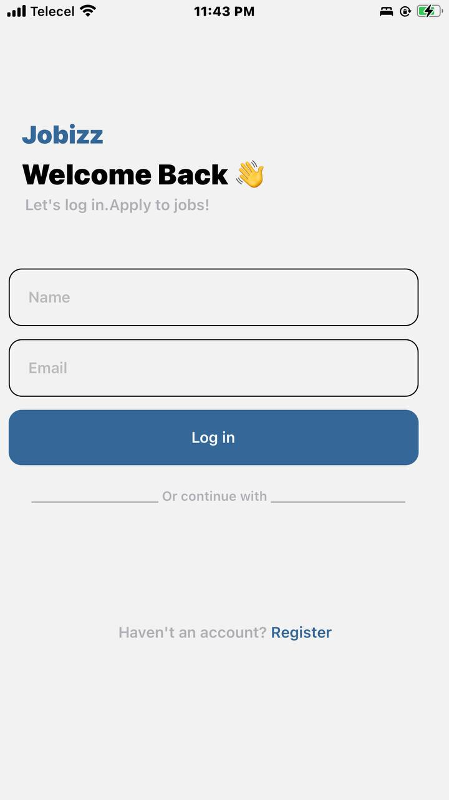

# 11065950 Oji Nana

This repository contains the implementation of Assignment 4 for the DCIT202 Mobile Application Development course. The assignment involves recreating a design as seen in the provided UI mockup, implementing login functionality, displaying user information on the home screen, designing and creating functional components for popular and featured job cards, and styling the application to match the UI design.

Screenshots

Home Screen
The home screen displays the user's name and email, which are received from the login screen. It also features popular and featured job cards, each displaying information about a specific job, such as job title, company name, location, and salary.

Popular and Featured Job Cards
These components are functional and customizable cards designed to display information about popular and featured job listings. They accept props containing details about the job, such as job title, company name, location, salary, and whether the job is featured or not.

Submission
Delete the node_modules directory.

Compress the repository folder.

Submit the compressed folder of your repository to Sakai.

Resources
UI Design - Access the UI Design here.
Figma File - Download resources for the application from the Figma file.